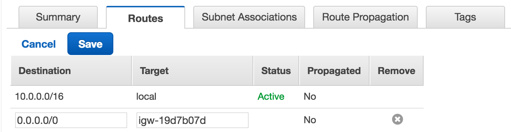
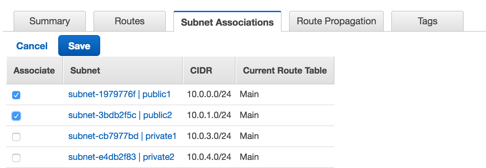
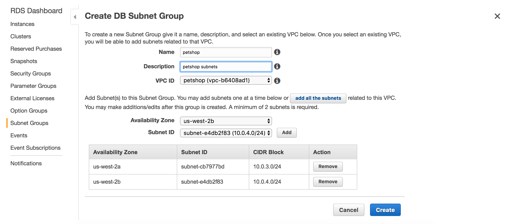
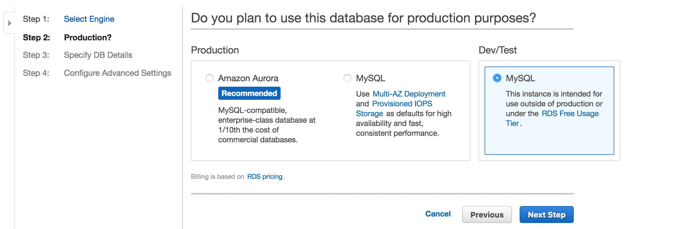
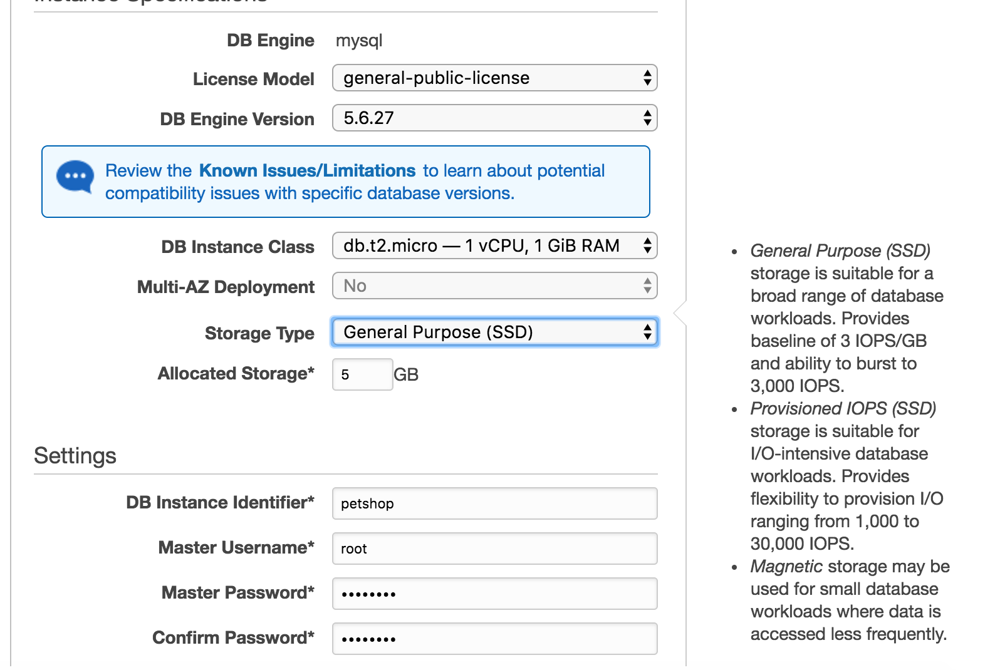
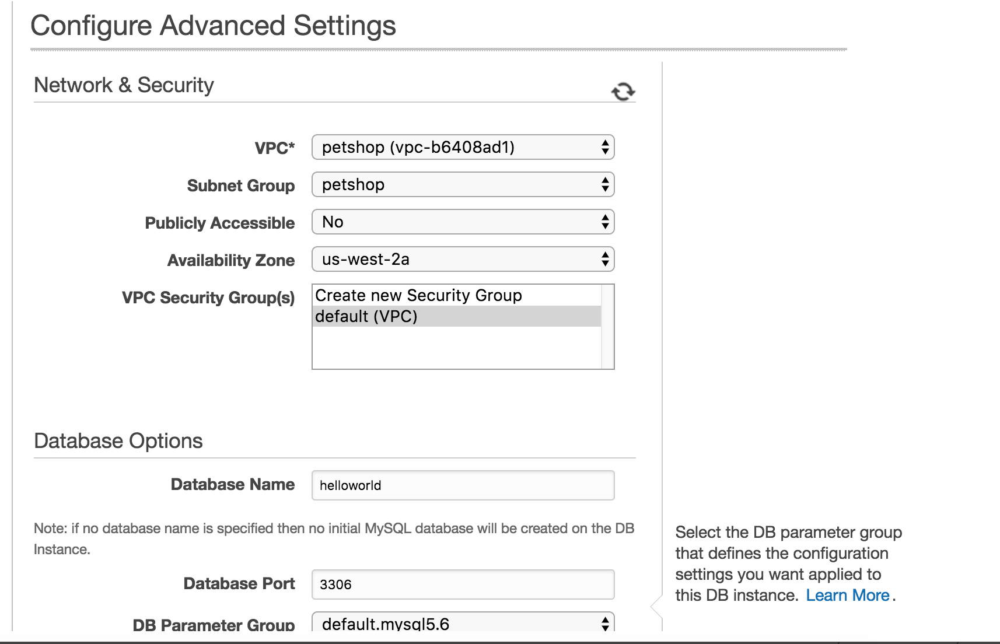
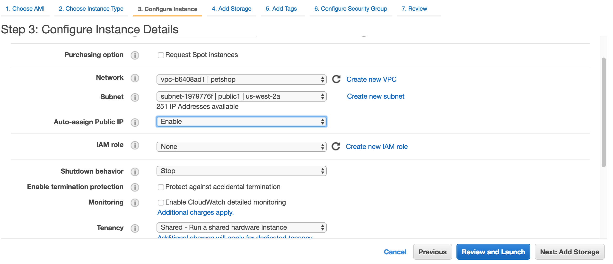
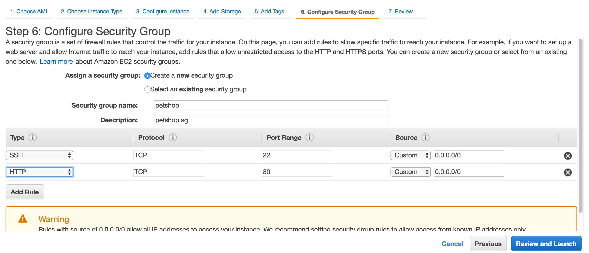
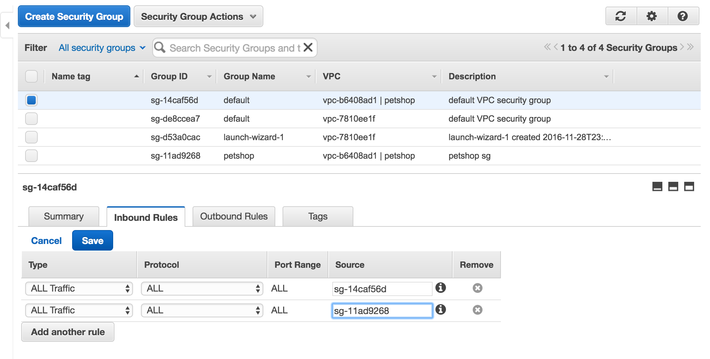
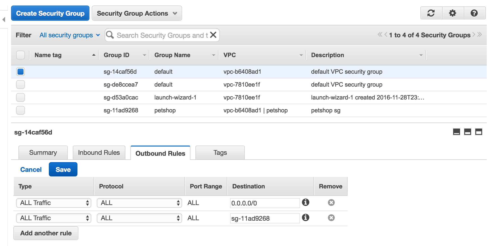

# db_migrate_demo

This project was to demonstrate how db-migrate works.

* db-migrate
  * [db-migrate SQL API](https://db-migrate.readthedocs.io/en/latest/API/SQL/)
  * [db-migrate Usage](https://db-migrate.readthedocs.io/en/latest/Getting%20Started/usage/)
  * npm install `db-migrate` and `db-migrate-mysq`
  * add `database.json` under root folder
  * npm install `mysql-promise` and define/export db object via `db.js`
  * create a `migrations` folder, and use `./node_modules/.bin/db-migrate create [filename]` to create migration files
  * use `co` and `db` in those migration files to do database operations
  * create a `migrate.js` and call `dbmigrate.up();` to start the migration process (technically we only need to implement `up` method in those migration files, since `dbmigrate.up()` only run up methods)
  * in index.js, add the following code to kick off the migration
  ```
  // run migrations
  if(process.env.NODE_ENV !== 'test') {
  	var migrate = require('./modules/migrate');
  }
  ```

* docker-compose
  * docker-compse file defined environment variables for database connection config
  * `"./schema:/docker-entrypoint-initdb.d/"` in docker-compse's mysql setting will import initial setting to mysql container
  * used docker version 2 network, so don't need to use `link`; of course, we need to create network first by using `docker network create jz_playground`

* db-query
  * see routes.js about how to use where clause in query

# Makefile
  * create a repo in dockerhub (https://hub.docker.com/r/jacky1999cn2000/db_migrate_and_docker/)
  * `$(info GIT_HASH: $(GIT_HASH))` to print out message in Makefile
  * use `make run` to do development (use `make bash` to do npm install to make sure all npm packages were installed on linux instance)
  * after done development, use `make push` to `install version build_image tag push`(in this order)
  * after this, the `jacky1999cn2000/db_migrate_and_docker:GIT_HASH` and `jacky1999cn2000/db_migrate_and_docker:latest` were pushed to dockerhub

# aws setup

I will followed part of the following tutorial. The tutorial also used ELB and Auto-scaling, but for this project, I won't touch those (so we probably wont' need 4 subnets...) since I will try that after learning more about ECS.

So what I tried to do is, create a VPC with public and private subnets, deploy RDS in private subnets and deploy EC2 in public subnets. Install docker in EC2 instance and try to run docker image from there

* [linux academy aws "configuring a web app in VPC" tutorial](https://www.youtube.com/watch?v=A1o4VhzZiU4&list=PLv2a_5pNAko3IkErhnF7zLhW3tlroTr2R&index=7)
* [ECS tutorial (also mention how to install docker in AWS Linux)](http://www.ybrikman.com/writing/2015/11/11/running-docker-aws-ground-up/)

* VPC - create a custom VPC
  * name: petshop
  * CIRD block: 10.0.0.0/16
  * tennancy: default

* Subnets - create 4 subnets, 2 public and 2 private, across 2 AZs
  * public1
    * name: public1
    * VPC: petshop
    * AZ: us-west-2a
    * CIDR block: 10.0.0.0/24
  * public2
    * name: public2
    * VPC: petshop
    * AZ: us-west-2b
    * CIDR block: 10.0.1.0/24
  * private1
    * name: private1
    * VPC: petshop
    * AZ: us-west-2a
    * CIDR block: 10.0.3.0/24
  * private2
    * name: private2
    * VPC: petshop
    * AZ: us-west-2b
    * CIDR block: 10.0.4.0/24

* Internet Gateway - create a IGW
  * name: petshop
  * attach to VPC: petshop

* Route Table - attach IGW to those 2 public subnets so they become "public"
  * name: petshop-public
  * VPC: petshop
  * Routes
    
  * Subnet Association
    

* RDS
  * DB-Subnet-Group - create db subnet group (add those 2 private subnets)
    
  * DB instance - should choose Multi-AZ for production, I didn't do so for free-tier
    
    
    

* EC2
  
  

* Security Group
  I created a new "petshop" Security Group for EC2 instance to use (the "petshop" Security Group in "petshop" VPC, with SSH and HTTP access), however, RDS used the default Security Group for "petshop" VPC. So in order to EC2 server to be able to access RDS, we need to add the following rules in the RDS's Security Group (a.k.a. the default Security Group for "petshop" VPC)
  
  
